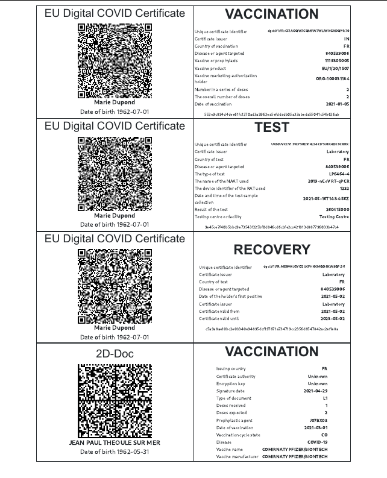

# covid-pass

Outil de génération d'une carte pass sanitaire imprimable.

### Note:  
Toutes les étapes sont effectuées sur votre terminal. Aucun échange de données n'est effectué entre votre appareil et le serveur une fois la page chargée.

## Construire votre carte:
1. Scanner son pass sanitaire depuis le site
1. Imprimer la page
1. Découper le contour du cadre rectangulaire
1. Plier pour former une carte 
1. Plastifier pour rendre la carte solide

Compatible avec:
* Certificat COVID Numérique UE (EUDCC)
* 2D-Doc (valable uniquement en France !)

Si vous possédez un pass sanitaire au format 2D-Doc et que vous souhaitez le convertir au format européen, il vous faudra l'importer dans l'application TousAntiCovid et le convertir au format européen. Le QR Code qui apparaitra alors dans l'application pourra être utilisé pour construire votre carte.

### Exemple:

